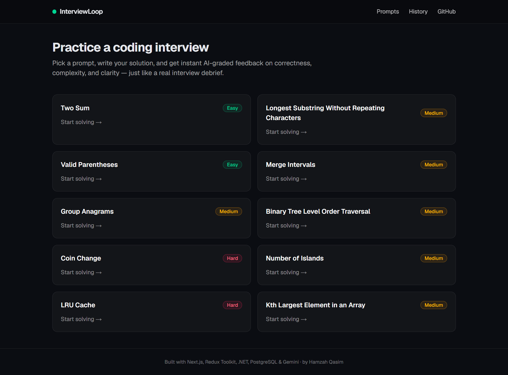
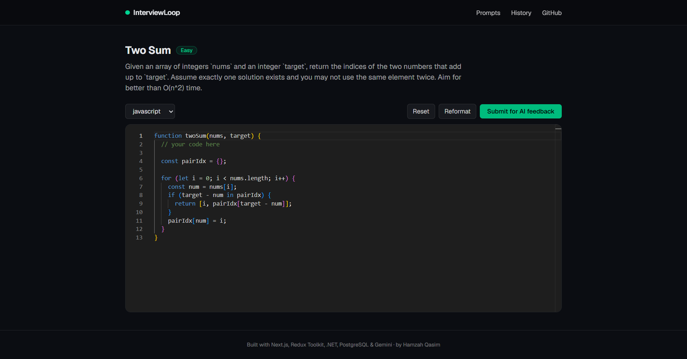
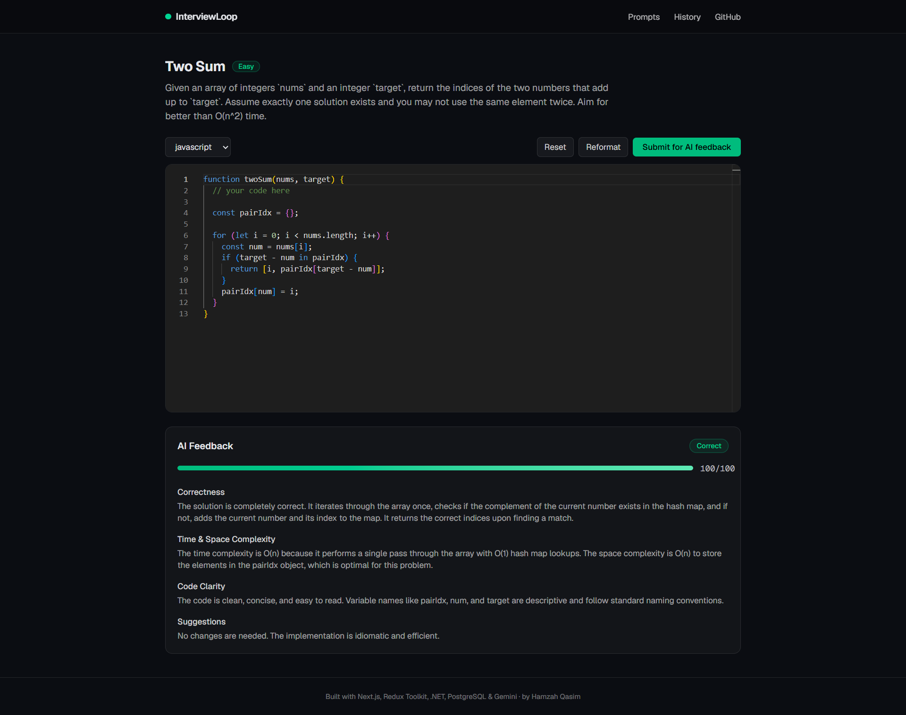
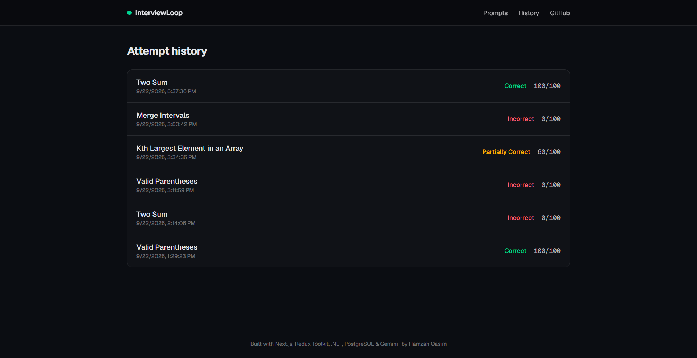
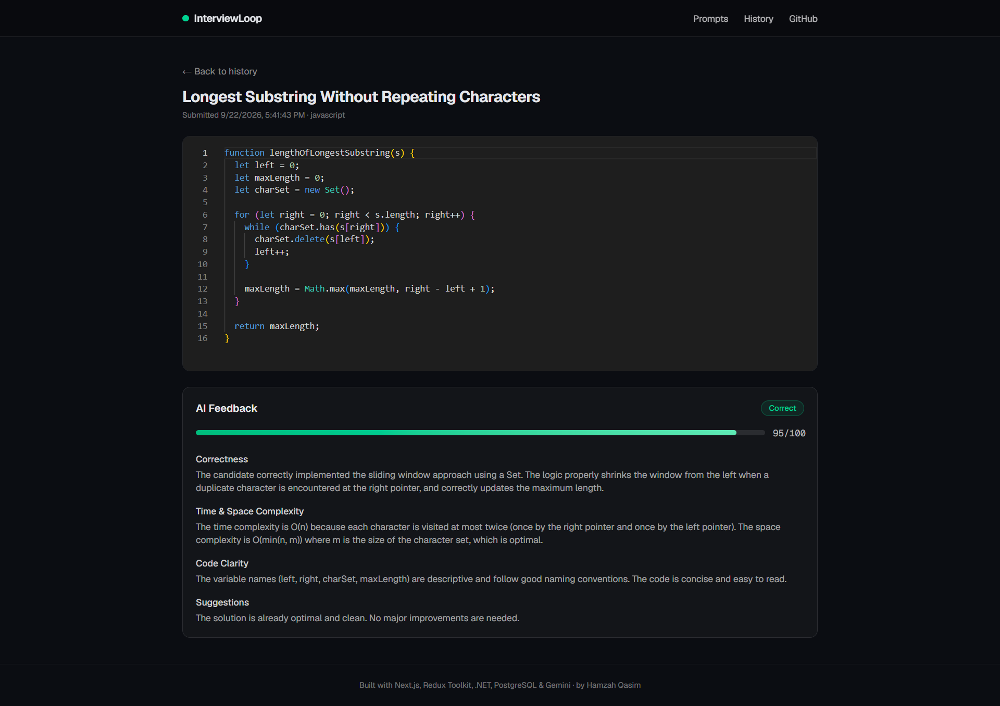
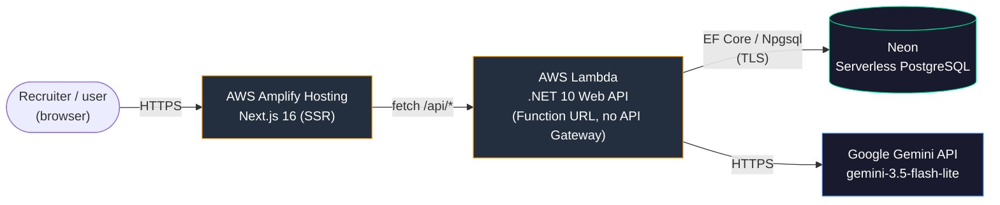
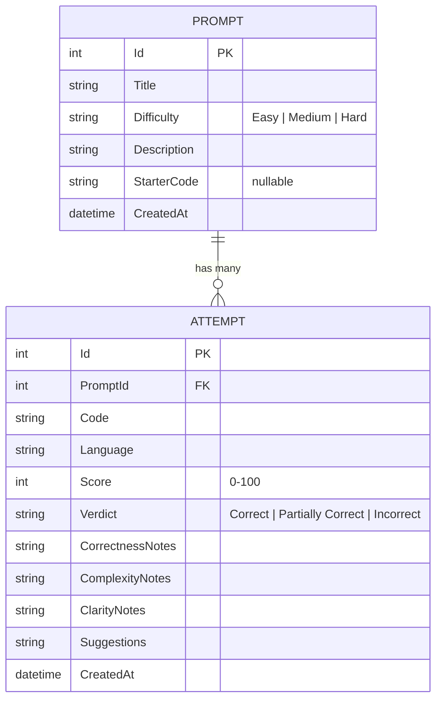

# InterviewLoop

[](https://github.com/Hqasim/interview-loop/actions/workflows/build-and-test.yml)


AI-graded mock coding interviews. Pick a prompt, solve it in an in-browser editor, and get
structured AI feedback on correctness, complexity, and clarity — plus a history of past attempts.
Built end-to-end (frontend, backend, database, AI integration, CI, cloud deployment) as a
full-stack portfolio project.

<p align="center">
  <a href="https://master.d9ozh3inwy25s.amplifyapp.com">
    
  </a>
</p>

---

## Screenshots

| Home | Solving a prompt |
|---|---|
|  |  |

| AI feedback | History |
|---|---|
|  |  |

| Attempt detail |
|---|
|  |

---

## What this demonstrates

- A full-stack app with a **real, live, publicly reachable URL** — not just a localhost demo.
- **AI integration done properly**: a JSON-schema-constrained Gemini response (not fragile
  free-text parsing), retry-with-backoff on transient upstream failures, and a deliberate split
  between the technical error (logged server-side) and a short, safe message shown to the user.
- **Server-side rate limiting** (ASP.NET Core's `RateLimiting` middleware, partitioned per client
  IP) protecting the one endpoint that costs real quota — paired with a client-side cooldown for
  UX, with an explicit design note in [DEPLOYMENT.md](./DEPLOYMENT.md) on *why* the enforcement
  had to live server-side.
- **Typed, cached client state** via Redux Toolkit + RTK Query — no hand-rolled fetch/loading/error
  plumbing per component.
- A **test suite that actually exercises failure modes**: 17 xUnit tests, including full
  request-pipeline tests via `WebApplicationFactory` + EF Core's InMemory provider, and isolated
  Gemini-response-parsing tests (via a fake `HttpMessageHandler`) that pin down two real bugs hit
  during development — a deprecated model name and a "thinking model" multi-part response shape.
- **CI on every push/PR** (GitHub Actions) building and testing both halves of the stack
  independently.
- **$0 infrastructure cost in production** — AWS Amplify Hosting + AWS Lambda (Function URL) +
  Neon serverless Postgres, all on permanently-free tiers, not a 12-month trial. The full
  deployment process — including the real-world gotchas hit along the way (a Lambda Function URL
  permission change, an AWS Organizations policy blocking a whole account) — is documented in
  [DEPLOYMENT.md](./DEPLOYMENT.md).

## Architecture



Every arrow above is a real network hop in production — there's no server-side rendering proxy
or BFF layer hiding what's actually talking to what.

## Data model



Deliberately just two tables: prompts are a curated, version-controlled catalog (seeded on
startup, no admin CRUD), and every submission is an immutable record of "this code got this
feedback at this time" — there's no edit/re-grade path, which is what makes the history view a
simple, honest audit trail.

## Tech stack

| Layer | Technology | Version |
|---|---|---|
| Frontend framework | [Next.js](https://nextjs.org) (App Router) | 16.3 |
| UI library | [React](https://react.dev) | 19.2 |
| Language | TypeScript | 5.x |
| State management | [Redux Toolkit](https://redux-toolkit.js.org) + RTK Query | 2.12 |
| Code editor | [Monaco Editor](https://microsoft.github.io/monaco-editor/) (via `@monaco-editor/react`) | 4.7 |
| Notifications | react-hot-toast | 2.6 |
| Backend framework | ASP.NET Core Web API | .NET 10 |
| ORM | Entity Framework Core (Npgsql provider) | 10.0 |
| Database | PostgreSQL | 16 locally / Neon serverless in production |
| AI grading | [Google Gemini API](https://ai.google.dev) | `gemini-3.5-flash-lite` |
| Backend hosting | AWS Lambda (Function URL, `dotnet10` managed runtime) | — |
| Frontend hosting | AWS Amplify Hosting (SSR) | — |
| CI | GitHub Actions | — |
| Testing | xUnit + `Microsoft.AspNetCore.Mvc.Testing` | — |

## API

| Method | Endpoint | Description |
|---|---|---|
| `GET` | `/api/prompts` | List all prompts (id, title, difficulty). |
| `GET` | `/api/prompts/{id}` | One prompt's full detail (description, starter code). |
| `POST` | `/api/attempts` | Grade a submission. Rate-limited to 1 request / 3s / client IP. |
| `GET` | `/api/attempts` | Attempt history, most recent first. |
| `GET` | `/api/attempts/{id}` | One attempt's full detail (code + feedback). |

## Project structure

```
backend/InterviewLoop.Api/         .NET 10 Web API (prompts, attempts, Gemini grading)
backend/InterviewLoop.Api.Tests/   xUnit tests (grading service + controllers)
frontend/                          Next.js app
frontend/screenshots/              README screenshots (see that folder's own README)
docker-compose.yml                 Local PostgreSQL for development
DEPLOYMENT.md                      Full AWS/Neon/Gemini deployment walkthrough
```

## Running locally

**1. Start Postgres:**

```bash
docker compose up -d
```

**2. Run the backend** (applies EF Core migrations and seeds prompts automatically on startup):

```bash
cd backend/InterviewLoop.Api
dotnet run
```

Runs on `http://localhost:5080` by default. Without a Gemini API key configured it serves
placeholder "demo mode" feedback so you can exercise the whole flow immediately. To enable real
AI grading, set an API key via user-secrets or an environment variable:

```bash
dotnet user-secrets set "Gemini:ApiKey" "<your-key>"
# or
export GEMINI__APIKEY="<your-key>"
```

**3. Run the frontend:**

```bash
cd frontend
npm install
npm run dev
```

Runs on `http://localhost:3000` and expects the API at `http://localhost:5080/api`
(configurable via `NEXT_PUBLIC_API_URL` in `frontend/.env.local`).

## Running tests

```bash
dotnet test InterviewLoop.slnx
```

Covers the Gemini response parsing/error-handling (including "thinking" models that split
reasoning and the answer into separate parts) and the Prompts/Attempts controllers end-to-end
against an in-memory database, without needing Postgres or a real Gemini API key running.

## Deployment

Deployed at $0 infrastructure cost: Next.js on AWS Amplify Hosting, the .NET API on AWS Lambda
behind a Function URL, and PostgreSQL on Neon's always-free tier — all within permanently-free
usage tiers rather than a 12-month trial. See [DEPLOYMENT.md](./DEPLOYMENT.md) for the full
walkthrough of how it's wired together, including real gotchas hit along the way (and how they
were fixed).

## Roadmap: V2 ideas

Ideas for extending this beyond the current MVP scope — not committed to a timeline, listed here
to show where the project could go next:

- **Live pair-interview mode** — a WebSocket-backed shared session where an interviewer and
  candidate see the same editor in real time, closer to an actual live interview than solo practice.
- **Real code execution** — actually run submissions in a sandboxed runner (e.g. Judge0 or a
  purpose-built Lambda) against test cases for a true pass/fail signal, complementing the AI's
  qualitative review rather than replacing it.
- **System-design prompts** — a second prompt type with a whiteboard/diagramming surface,
  graded qualitatively by AI alongside the existing coding prompts.
- **Accounts + per-user history** — AWS Cognito login so progress is tied to a profile instead
  of being fully anonymous, unlocking difficulty-adaptive prompt recommendations based on past
  performance.
- **Resume bullet generator** — turn a user's strongest attempts into portfolio-ready resume
  bullets via AI, closing the loop between "practiced here" and "used it to land a job."
- **Community stats / leaderboard** — aggregated, anonymized stats (average score per prompt,
  most-used languages) for social proof and light gamification.
- **Automated CD** — a GitHub Actions deploy job using OIDC to assume an AWS role on merge to
  `main`, replacing the current manual `dotnet lambda deploy-function` / Amplify auto-build flow.
- **Observability** — Sentry error monitoring and structured logging dashboards, matching the
  monitoring stack listed on the author's resume.
- **Custom domain** — a real domain in front of the Amplify URL.

## Author

Built by [Hamzah Qasim](https://github.com/Hqasim).
